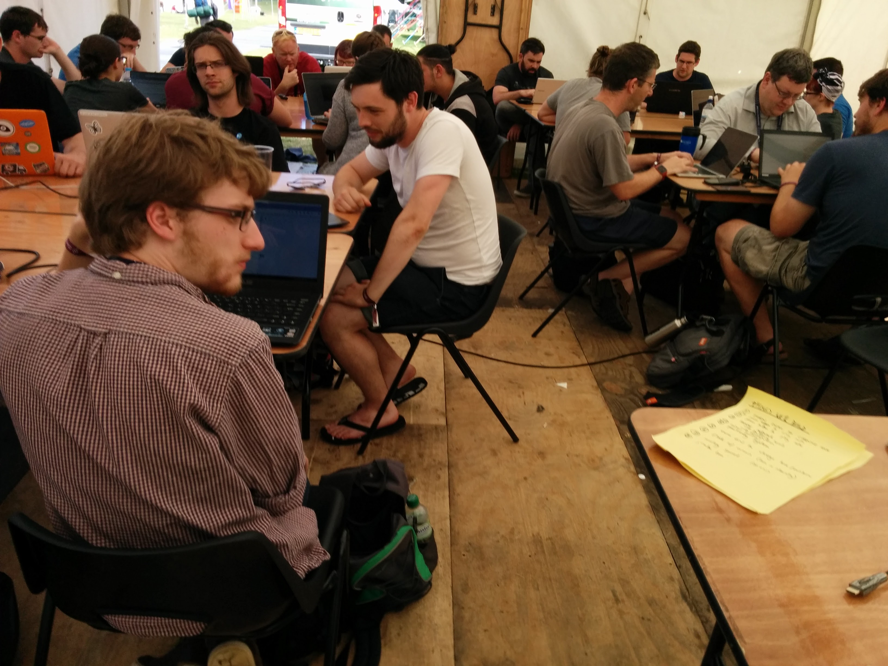

# [fit] HELLO!
## [fit] I'm [@benjaminbenben](https://twitter.com/benjaminbenben)!

---

# [fit] I work at [@Pusher](https://twitter.com/pusher)


---


---

# [fit] I co-organise [@JSOxford](https://twitter.com/jsoxford)


---


---

# I've not really said this stuff yet

## 1. Tell me if we've been here too long
## 2. I'd be happy (and sorry) if you tell me this is rubbish

---

# [fit] Live coding <br />across all <br />the things

---

# [fit] ~~Live coding <br />across all <br />the things~~

---

# [fit] How to build a
# [fit] __collaborative__
# [fit] *browser-based* editor
### (and why)

---

# ⤷ Browser-based editors

---


---

### side note - not just frontend


^ this can go further than js

---


---


# [fit] cojs.co


---

# 💥

---

# /

---

# / <br />⤷ The challenges

---


---

# The challenges

* Making a textarea feel nice
* Showing content
* Code transpilation
* External modules
* Not breaking things

---

# / <br />⤷ The challenges
# Making a textarea feel nice


---

# [fit] Web based code editors

## (maybe don't write one yourself)

* Ace Editor
* Monaco
* CodeMirror
* ~Atom~

^ Atom is interesting

---


---

# [fit] Integration with our textarea

```js
CodeMirror.fromTextArea(source)
```

^ hooks in the change events transparently

---

# …tonnes more stuff


---

# / <br />⤷ The challenges
# Showing content

```html
<iframe id="target" href="/mypage"></iframe>
```

## (normal answer: host it somewhere)

# [fit] <br/><br/> 💥

---

## Option 1.

----

# "Upload" to ServiceWorker

## [fit] Web page → Service Worker → Network


---

# hmmmmm

* trendy
* cool
* persistant urls
* overkill possibly
* support is … _positive?_
* really cool

---

## Option 2.

---

# [fit] Data URIs

---

# [fit] data:[<mediatype>][;base64],<data>

---

# [fit] data:text/html,<h1>Hello!

# 💥

---

```js
iframe.src = 'data:text/html;charset=utf-8,'+
             '%3Cbody%3E%3Cscript%3E' +
             encodeURI(source.value) +
             '%3C/script%3E'
```


---


# hmmm

* lack of error handling
* length limitations
* random encoding issues
* restrictions…


---


---

## Option 3.

---

# [fit] Blobs

# [fit] new Blob(blobParts[, options])

---

```js
b = new Blob(['…'], {type: 'text/html'})
```

---

```js
b = new Blob(['…'], {type: 'text/html'})

url = URL.createObjectURL(b)

// "blob:https%3A/…/2084018…ab3a2cec02"


// later
URL.revokeObjectURL(url)
```

# 💥

---


```js

var blob = generate(source.value)
URL.revokeObjectURL(target.src)

iframe.src = URL.createObjectURL(blob)

```

---

# hmmm!

* not stored on the stack
* safe, and lots of control
* sounds cool


---

# / <br />⤷ The challenges
# Code transpilation

---


# ES2015

```js
const hey = (you) =>
  console.log(`HELLO ${you}`)
```

# 💥


---

## [fit] Tracuer
## [fit] Babel
## [fit] Bublé

^ first (2011)

^ es6to5

^ new, cool

---

All pretty cool, though personally

# [fit] ♥️Bublé

---

# Bublé

* inspired by Babel
* no shims / polyfills
* compact transforms only
* less extensibility
* fast
* Nice one, Rich Harris

<!--## browserify, webpack, requirejs, sprokets, brocolli, grunt, gulp, brunch, ……-->

---

```js
buble.transform(source.value).code
```


---

# / <br />⤷ The challenges
# External modules

---


```js
// commonjs
const utils = require('utils')
utils.say('yeah!')


// ES2015 modules
import {say} from 'utils'
say('yeah!')
```


---

# bundling

# 💥

---

# [fit] Webpack
# [fit] Browserify
# [fit] Rollup

---

All pretty cool, though…

# [fit] ♥️Rollup

---

# Rollup

* embracing ES2015 modules
* minimal code-rewriting
* tree shaking
* d3, THREE.js


---

# Rollup

* embracing ES2015 modules
* minimal code-rewriting
* tree shaking
* d3, THREE.js
* Seriously, Rich Harris you're the best


---

```js
rollup.rollup({
  entry: '__main__',
  plugins:[
    {
      resolveId: (i) => i,
      load: (id) => {
        if(id == '__main__') return source.value
        return fetch('/module/' + id + '.js')
      }
    }
  ]
}).then(bundle =>
  bundle.generate({
    format: 'iife'
  }).code
)
```

---

# / <br />⤷ The challenges
# Not breaking things

---


```js
for(var i = 99; i > 0; i++) {
  console.log(`${i} bottles of beer`)
}
```

---

# [fit] jsbin/loop-protect
## Super props, Remy Sharp

```js
loopProtect(`for(var i = 99; i > 0; i++) {
  console.log(\`${i} bottles of beer\`)
}`)
```

---

```js
{;loopProtect.protect({ line: 1, reset: true });
for(var i = 99; i > 0; i++) {
  if (loopProtect.protect({ line: 1 })) break;
  console.log(`${i} bottles of beer`)
}
```

# 💥

---

# /

---

# / <br />⤷ Why

---

# Closing the loop

---

# Closing the loop

# change, save, __tab__, ftp, wait, __tab__, refresh

### Uploading stuff to a server

---

# Closing the loop

# change, save, __tab__, refresh

### Local development

---

# Closing the loop

# change, save

### Live reload+

---

# Closing the loop

# change

### In place editing

---

## This is a good thing

---

# / <br />⤷ Why
# Multi Device Development Experiments

---

## /1
# [fit] Collaboration

---


---


## /2
# [fit] Broadcast

---


## /2.1 (Broadcast)
# [fit] For development

---


## /2.2 (Broadcast)
# [fit] For talk-workshops

---


## /3
# [fit] Social inspired development

<!---->

---

# /

---

# / demo?
## let's build a "musical instrument"

<!--
---

# Playing pictionary

# Code should read like an essay

# Naming is hard


-->

---

# People & user experience are the difficult things

## (so let's focus on them)

---

# Thank you,

# [fit] I'm @benjaminbenben
## (also, right here)
