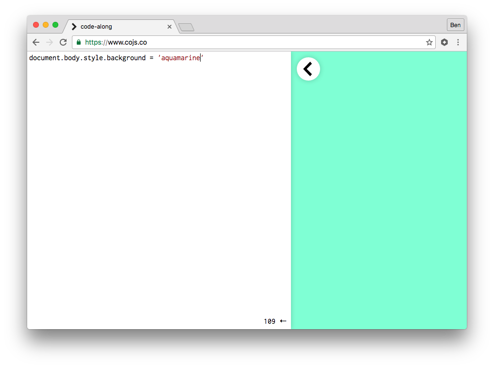

# [fit] HELLO!
## [fit] I'm [@benjaminbenben](https://twitter.com/benjaminbenben)!

---

# [fit] I work at [@Pusher](https://twitter.com/pusher)


---

# [fit] I co-organise [@JSOxford](https://twitter.com/jsoxford)


---

# [fit] Live coding <br />across all <br />the things

---

## Part 1
# [fit] Live coding

---

# Closing the feedback loop

# change, save, __tab__, ftp, wait, __tab__, refresh

---

# Closing the feedback loop

# change, save, __tab__, refresh

---

# Closing the feedback loop

# change, save

---

# Closing the feedback loop

# change

---

# [fit] Using a browser

* take the editing to the viewing
* easy to skip filesystem

---


---



---

# [fit] But how?!

---

# [fit] Hyper Text

```html
<textarea id="source"></textarea>

<iframe id="target"></iframe>
```

---

# [fit] #target content

```html
<body><script>
{OUR JAVASCRIPT}
</script></body>
```

---

# [fit] Data URIs

# [fit] data:[<mediatype>][;base64],<data>

# [fit] data:text/html,<h1>Hello!

---

```js
source.onkeyup = function() {
  target.src = 'data:text/html;charset=utf-8,'+
               '%3Cbody%3E%3Cscript%3E' +
               encodeURI(source.value) +
               '%3C/script%3E'
}
```

---

alternatively

# [fit] Blobs

# [fit] new Blob(blobParts[, options])

---

```js

b = new Blob(['…'], {type: 'text/html'})

url = URL.createObjectURL(b)

// "blob:https%3A/…/2084018…ab3a2cec02"


// later
URL.revokeObjectURL(url)
```

---


```js
source.onkeyup = function() {
  var blob = generate(source.value)
  URL.revokeObjectURL(target.src)

  target.src = URL.createObjectURL(blob)
}
```

---

or, maybe

# [fit] Service <br />Workers

---

```js
serviceWorker.register('worker-script.js')

// worker-script.js
self.addEventListener('fetch', event =>
  event.respondWith(
    caches.match(event.request)
      .then(response =>
        response || fetch(event.request)
      )
    )
  )
```

---

```js
const response = new Response(myBlob, {
    headers: {'Content-Type': 'text/html'}
  })

caches.open('whatever')
  .then(cache =>
    cache.put('/sw-url', response)
  )
```

---


```html
<iframe src="/sw-url"></iframe>
```

---

# [fit] / Showing content

---

# [fit] UI

---


---

# [fit] Web based code editors

## (maybe don't write one yourself)

* CodeMirror
* Ace Editor
* Monaco

---


---

# [fit] Integration with our textarea

```js
CodeMirror.fromTextArea(source)
```

^ hooks in the change events transparently

---

# …tonnes more stuff

---

# [fit] /UI

---

# [fit] JavaScript

## It's not like it used to be

---

# ES2015

```js
const hey = (you) =>
  console.log(`HELLO ${you}`)
```
---

## [fit] Tracuer
## [fit] Babel
## [fit] Bublé

^ first (2011)

^ es6to5

^ new, cool

---

All pretty cool, though personally

# [fit] ♥️Bublé

---

# Bublé

* inspired by Babel
* no shims / polyfills
* compact transforms only
* less extensibility
* fast
* Nice one, Rich Harris

<!--## browserify, webpack, requirejs, sprokets, brocolli, grunt, gulp, brunch, ……-->

---

```js
buble.transform(source.value).code
```

---

# [fit] …JavaScript

## There's more of it than there used to be

---

```js
// commonjs
const utils = require('utils')
utils.say('yeah!')


// ES2015 modules
import {say} from 'utils'
say('yeah!')
```

---

# [fit] Webpack
# [fit] Browserify
# [fit] Rollup

---

All pretty cool, though…

# [fit] ♥️Rollup

---

# Rollup

* embracing ES2015 modules
* minimal code-rewriting
* tree shaking
* d3, THREE.js
* You're the best, Rich Harris


---

```js
rollup.rollup({
  entry: '__main__',
  plugins:[
    {
      resolveId: (i) => i,
      load: (id) => {
        if(id == '__main__') return source.value
        return fetch('/module/' + id + '.js')
      }
    }
  ]
}).then(bundle =>
  bundle.generate({
    format: 'iife'
  }).code
)
```


---

# [fit] JavaScript…

## Sometimes your JavaScript can break things

---

```js
for(var i = 99; i > 0; i++) {
  console.log(`${i} bottles of beer`)
}
```

---

# [fit] jsbin/loop-protect
## Major props, Remy Sharp

```js
loopProtect(`for(var i = 99; i > 0; i++) {
  console.log(\`${i} bottles of beer\`)
}`)
```

---

```js
{;loopProtect.protect({ line: 1, reset: true });
for(var i = 99; i > 0; i++) {
  if (loopProtect.protect({ line: 1 })) break;
  console.log(`${i} bottles of beer`)
}
```


---

# [fit] /Java<br/>Script

---


---

## Part 2
# [fit] across all <br/>the things
